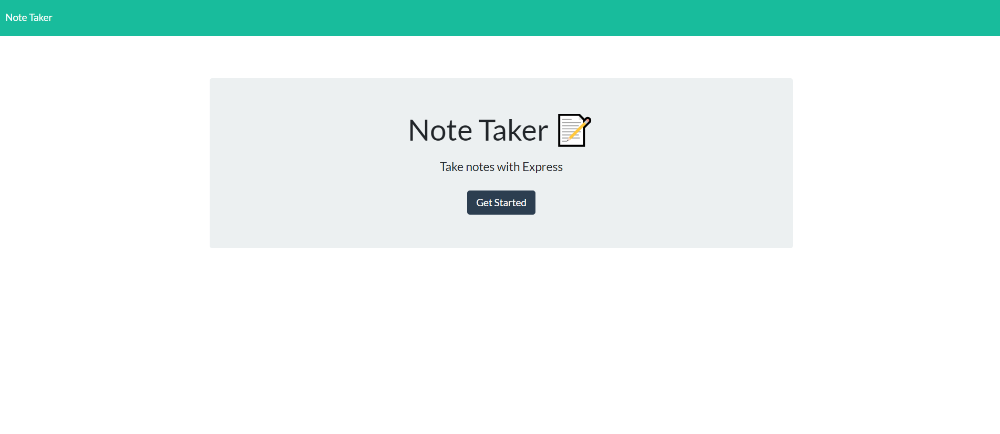
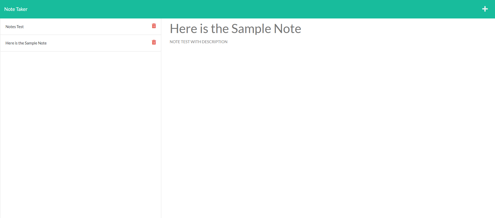

# 11 Express.js: Note Taker
## Module 11 Challenge

## Description
The goal of this challenge was to create a Note Taker app that can be used to write and save notes. The app will be based on an Express.js back end and will retrieve and save data from a JSON file. The code for the front end of the application was already given.

## Deployed App Link
This [link](https://gentle-temple-02874.herokuapp.com/) will take you to the app deployed on heroku.

## User Story
AS A small business owner
I WANT to be able to write and save notes
SO THAT I can organize my thoughts and keep track of tasks I need to complete

## Acceptance Criteria
GIVEN a note-taking application
* WHEN I open the Note Taker
    - THEN I am presented with a landing page with a link to a notes page
* WHEN I click on the link to the notes page
    - THEN I am presented with a page with existing notes listed in the left-hand column, plus empty fields to enter a new note title and the note’s text in the right-hand column
* WHEN I enter a new note title and the note’s text
    - THEN a Save icon appears in the navigation at the top of the page
* WHEN I click on the Save icon
    - THEN the new note I have entered is saved and appears in the left-hand column with the other existing notes
* WHEN I click on an existing note in the list in the left-hand column
    - THEN that note appears in the right-hand column
* WHEN I click on the Write icon in the navigation at the top of the page
    - THEN I am presented with empty fields to enter a new note title and the note’s text in the right-hand column

## Screenshots

## Github Repo Link
This [link](https://github.com/tyomoto/bookish-telegram) will take you to the code repository on github.
